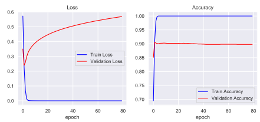

# Deep_Learning_Work

This work was done as a group project aiming to classify two datasets, one image-based and one text. This author, David Smith,
contributed the text analysis, which this document discusses. A short report of this analysis can be found [here](report.pdf).

## Sentiment Analysis of the IMDb Movie Review Dataset

This project was handling the renowned IMDb dataset, containing 50,000 positive and negative movie reviews. The dataset was 
read in ```imdb.py```. After encoding the reviews as integers, stopword removal was carried out. The reviews were standardised
to a length of 512 words, in order to be fed into our model. 

We used a convolutional neural network:


Using only a single convolutional block, we had a significantly high number of filters. This would allow us to find many different
levels of abstraction in the reviews. 

## Training 

The reviews were split into 25,000 for training and 25,000 for testing. The model converged quickly during training, as can be seen
below:



## Testing

We experimented with a range of configurations. These can be explored by following the comment instructions in the ```run_first_combo```
and ```run_second_combo``` functions. Our top three model testing accuracies were as follows:


We experimented with a range of optimizers, epochs, batch sizes and learning rates. The Adam optimizer, with a batch
size of 512 and learning rate of 0.001 proved optimum, achieving a testing accuracy of 89.3%. 
